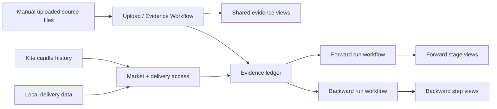

# Dual Conviction Systems — High-Level Design

Compiled from [dual-conviction-systems-interview-log.md](/Users/kushbhardwaj/Documents/github/TradingTool-3/tasks/understanding/dual-conviction-systems-interview-log.md). The interview log remains the raw discovery history. This document is the current stable HLD.

## 1. Purpose

Build two separate Wyckoff-first decision-support systems on top of one shared evidence intake:

| System | Starts from | Main question | Typical use |
|---|---|---|---|
| **Forward High Conviction** | Accumulation evidence | Which stocks are quietly building cause and deserve conviction before markup? | Investor-cum-trader research flow |
| **Backward Forensics** | Current Phase D participation evidence | Is today’s move backed by a real accumulation period? | Trader validation / forensics flow |

The same stock can appear in both systems, but the systems remain logically separate in workflow, candidate lists, interpretation, and UI.

## 2. Core Principles

1. **Visibility first:** every important step must be inspectable. No black-box final-only workflow.
2. **Validation first:** raw evidence, derived linkage, acceptance reasons, and rejection reasons must remain visible.
3. **Two workflows, one evidence layer:** upload/evidence browsing is shared; Forward and Backward execution are separate.
4. **Manual daily intake:** external files are uploaded by hand. No auto-ingestion.
5. **Human execution remains external:** the system does not place orders.
6. **Single-user simplicity:** prefer clear, revisable workflows over elaborate architecture.
7. **Backtesting matters:** the system must support historical reruns over uploaded history to mature the business logic.

## 3. High-Level Shape

## 4. Shared Foundation

### 4.1 Upload / Evidence Workflow

Upload is a separate workflow from execution. Its job is to capture data and make it inspectable. It is not a hidden staging step for an automatic run.

Responsibilities:
- accept the shared daily manual file batch
- validate file structure and row structure
- expose raw uploaded data
- expose historical source data across the uploaded lookback window
- expose stock-first and document-first exploration paths
- expose source-to-source linkage and derived evidence flow

Boundary:
- upload workflow stops at intake, sanity, and linkage visibility
- upload workflow does not perform Forward-style interpretation/staging

Shared daily external sources:
- Groww volume shocker
- minimum-volume scanners: `LVQ`, `LV100`, `LVY`
- ignition scanners
- Phase D / momentum scanners
- accumulation scanners

Local delivery anomaly is computed from local data and is not an uploaded file.

Batch rules:
- Forward and Backward share one upload batch
- partial external batch acceptance is not allowed
- file structure must be valid across all rows
- invalid files should not become eligible for run-batch acceptance
- raw uploaded data must still remain visible for inspection/debugging

### 4.2 Evidence Browsing

The shared evidence browser must support both:
- **document-first exploration**
- **stock-first exploration**

Document views should support:
- selected date-range filtering
- per-date counts
- per-stock repeat counts
- latest appearance date per stock

Example:
- `BHEL | 7 times | latest: 2026-06-24`

Stock views should support:
- merged chronological timeline across sources
- newest-first ordering by default
- both raw source events and derived system events
- source name and source-specific date on each row
- separate rows even when raw and derived events share the same date

### 4.3 Market Data

The system uses:
- Kite candle history
- local delivery data
- derived local delivery anomaly

Rules:
- missing local delivery data is visible but not a run blocker
- missing Kite candle history on an open market day is treated as a system issue and should stop the relevant run
- such failures must stay visible, not be hidden

### 4.4 Date Scope and Reruns

Uploaded source data can cover roughly nine months of history. Run workflows must support:
- `today`
- configurable defaults such as `last 30 days`
- custom date ranges
- full available period

History rules:
- results are visible only for the selected date range
- no empty rows for holidays/weekends/no-result dates
- historical dates must be rerunnable
- rerun-and-replace is sufficient for HLD

Storage/rerun rule:
- for a given date, the latest rerun replaces the earlier result
- avoid multiple same-date result snapshots in user-facing history

### 4.5 Shared Cross-Cutting UI Rules

All major views should:
- default to `today` in live mode
- clearly show the active date range
- support CSV export

CSV exports should include:
- active date range
- stage/step-specific dates
- source names

## 5. Forward High Conviction

### 5.1 Responsibility

Forward exists to find accumulation early, preserve its history, build conviction over time, and track later markup signals without collapsing everything into one score.

### 5.2 Main Stages

The current HLD stages are:

1. `raw accumulation`
2. `valid accumulation`
3. `high conviction`
4. `ignition seen`
5. `Phase D seen`
6. `breakout near`
7. `breakout done`

These stages are overlapping views, not mutually exclusive single-state buckets. A stock can remain visible in earlier and later stage lists at the same time because the dates differ and historical context matters.

### 5.3 Stage Rules

`raw accumulation`
- detects where accumulation exists
- preserves accumulation length and accumulation start context
- requires only accumulation-source hit plus chain found, with no extra early filter

`valid accumulation`
- promoted from raw accumulation by **shape validation only**
- should show explicit acceptance reason summaries
- should also show explicit rejection reasons for failed raw candidates

Accepted examples:
- flat accumulation
- cup accumulation
- base length in sessions

Rejected examples:
- inverted-U shape
- broken base
- distribution-like structure

`high conviction`
- remains system-driven, not manually promoted
- should remain visible unless a later downgrade workflow is explicitly designed
- simple priority logic is preferred over a complex rank/score

Priority intent:
- flat accumulations first
- then longer bases
- then stronger supporting delivery/LVQ support

Core evidence intent:
- flat accumulation
- accumulation length
- repeated low-hit behavior
- delivery footprint
- volume dryness

For now, list sorting can remain manual in the UI.

`ignition seen`
- can be triggered by:
  - Chartink ignition
  - delivery shock

`Phase D seen`
- can be satisfied by any accepted Phase D evidence source:
  - Chartink ignition
  - Chartink momentum
  - Groww volume shocker
  - local delivery anomaly

`breakout near`
- means price is within `6%` below the Kotlin-derived resistance

`breakout done`
- means daily close is above the Kotlin-derived resistance
- intraday failed breakout attempts should still remain visible

For HLD, `breakout done` remains inside the same Forward flow. Post-breakout workflow splitting can be refined later during implementation if needed.

### 5.4 Supporting Evidence

Forward should use a small set of main stages plus supporting evidence badges.

Required HLD-level supporting badges:
- `LVQ`
- `LV100`
- `LVY`
- `volume dry-up`
- `delivery abnormal`
- `high volume`
- `Groww shocker`

Rules:
- these are supporting evidence signals, not rigid ordered gates
- they can appear before or during Phase D
- latest date should be the headline value
- repeating signals should also show count
- history should remain inspectable because repeated hits build conviction

### 5.5 Breakout Context

Breakout context must remain visible throughout the Forward flow.

Required fields:
- exact resistance value
- current distance from resistance
- breakout status

Resistance must be derived by Kotlin candle-structure logic.

### 5.6 Research Layer

Research applies only to Forward.

HLD-level research support:
- simple notes
- manual quality tags such as `A+`, `A`, `B`, `C`

Rules:
- tags are completely manual
- notes/tags remain attached to the same case as it moves through later stages

### 5.7 Forward Case Persistence

Forward cases should not disappear just because they were not bought immediately.

Reasons:
- capital is limited
- valid setups may be prioritized rather than acted on immediately
- buying a few days into Phase D can still be relevant

If the same stock later forms a genuinely new accumulation campaign, that becomes a new case.

## 6. Backward Forensics

### 6.1 Responsibility

Backward starts from current Phase D participation evidence and works backward to prove whether the move is backed by an accumulation period.

The accumulation does not need to be the strongest possible pattern, but there must be an accumulation period behind the move.

### 6.2 Main Step Views

Current HLD bucket names:

1. `raw phase d signals`
2. `validated phase d signals`
3. `converged phase d signals`
4. `accumulation-backed phase d candidates`

As with Forward, these are visible step outputs and can overlap. A stock may remain visible across multiple step views at once.

### 6.3 Accepted Phase D Sources

Backward uses these Phase D sources:
- Chartink ignition
- Chartink momentum
- Groww volume shocker
- local delivery anomaly

Convergence rules:
- use a configurable day window
- show separate dates per source
- show the convergence result
- explicitly show which source dates contributed inside the window

### 6.4 Output Detail

Backward should not collapse to a binary yes/no result. It should reuse the same descriptive field pattern as Forward where practical.

Important summary fields:
- accumulation start date
- accumulation end date
- accumulation length
- shape
- latest Phase D source dates
- source badges such as ignition, momentum, Groww, delivery anomaly

Backward may also show breakout context, though this is lower priority than in Forward.

## 7. Execution Model

### 7.1 Separate Run Workflows

Forward and Backward run in separate execution UIs.

Users may:
- run only Forward
- run only Backward
- run only a subset of the workflow for validation

### 7.2 Step Dependency

Steps remain separately visible, but later steps depend on earlier step outputs.

If a required upstream step has not been run:
- the UI should surface an explicit error

### 7.3 Reason Visibility

Each meaningful stage/step should expose:
- acceptance reason summary
- rejection reason summary where relevant
- latest stage/step date
- historical prior hits where conviction/validation benefits from history

## 8. Timeline and Date Semantics

Primary displayed stage/step date:
- use the **latest matching date**

Historical earlier hits:
- remain available in history/timelines

This applies to both:
- main stages
- repeating supporting evidence

Refinement note:
- exact timeline/history presentation details remain implementation-sensitive
- if validation shows a better behavior for single-user workflow clarity, refine this during module-level LLD and implementation rather than forcing more HLD detail now

## 9. Position Tracking

The system does not place orders, but it should track holdings state using external broker data.

Preferred source of truth:
- Kite holdings
- Kite history
- GTT where relevant

Immediate priority:
- current open holdings

Later expected support:
- sold/closed position history

If a stock is sold and later forms a new accumulation campaign:
- create a new case
- preserve the old trade/case history separately

## 10. Deferred Implementation Decisions

These points are intentionally left for LLD / implementation refinement:
- whether any dedicated post-breakout view is needed beyond the current Forward flow
- exact downgrade workflow for stale/weakened high-conviction cases
- exact closed-position/history synchronization detail from Kite
- any further UI density tuning required for a single-user workflow
- exact timeline/date/history presentation semantics where implementation-time validation gives a better answer
