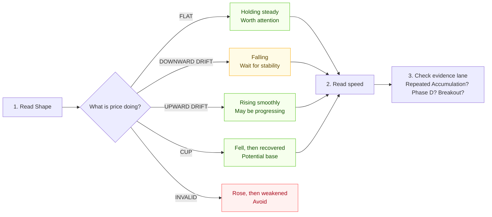

# Reading “Decision metric” without maths

This column answers one simple question:

> During this 60-session base, was the price holding steady, falling, rising, or genuinely turning?

It is **not** a buy or sell signal. It only describes the price behaviour behind an Accumulation hit, so you can decide what deserves your attention.

## Read a row in three seconds



1. **Shape** tells you the overall story.
2. **Decision metric** tells you how quickly the price was moving.
3. **Evidence lane** tells you whether the stock kept appearing in your scanners.

The best use of this page is to find a short list to inspect on a chart. It should reduce your workload, not replace your judgement.

## The first number: direction and speed

The compact value looks like this:

`-0.4%/10 · a -0.04`

For day-to-day use, read only the first part: **`-0.4%/10`**.

It means: on average, the price moved **down 0.4% every 10 trading sessions** during this base.

| What you see | Plain-English meaning | What to do |
|---|---|---|
| `0.0%/10` or a small number | Price is mostly holding its ground | Put it on the review list |
| `-0.4%/10` | Slightly weak / gently falling | Watch, but wait for it to settle |
| `-1.8%/10` | Clearly falling | Lower priority |
| `-5.2%/10` | Falling fast | Ignore for now |
| `+0.8%/10` | Gently rising | Check whether it is progressing out of a base |

There is no magic cut-off. These numbers help compare rows with each other. A stock falling `-5.2%/10` deserves far less attention than one holding around `0%/10`.

## The Shape is the headline

| Shape | Imagine it as | Simple interpretation |
|---|---|---|
| `FLAT` | A table top | Price held roughly the same level for weeks. This is the calm behaviour we want to examine. |
| `DOWNWARD_DRIFT` | A gentle ramp down | Price is still losing ground. It may later form a base, but it is not calm yet. |
| `UPWARD_DRIFT` | A gentle ramp up | Price is gradually improving. It may be re-accumulating or already progressing. |
| `CUP` | A shallow bowl | Price fell, stopped, and recovered within the same 60 sessions. |
| `INVALID` | A hill | Price rose and then weakened inside the window. Treat it as possible distribution, not accumulation. |

`VALID` means only **“this shape is allowed through the filter.”** It does **not** mean “buy this stock.”

## The hover details — only when you want to investigate

Hovering the metric shows three extra lines. Think of them as a short story:

| Hover line | Plain-English question it answers |
|---|---|
| **Center slope** | Was the whole 60-session period broadly rising or falling? |
| **Start → end slope** | Did the move get stronger, weaker, or reverse? |
| **Curvature / turn** | Did price actually bend and turn inside this 60-session period? |

Example:

```text
Center slope: -0.58% per 10 sessions
Start → end slope: -0.17% → -0.99%
Curvature: -0.006 · turn: -1.42
```

Read it as:

> “It was gently falling overall. It began almost flat, then fell faster. There was no meaningful turnaround during this base.”

You can ignore **curvature** and **turn** unless the Shape says `CUP` or `INVALID`. The system uses them only to check whether there was a real bowl or hill, rather than a simple smooth drift.

## Example: the ITC rows in the table

| Row | What it says in normal language |
|---|---|
| `FLAT`, `-0.4%/10` | “ITC mostly held steady from 25 Mar to 24 Jun, with a slight softening.” This is the row to inspect first. |
| `DOWNWARD_DRIFT`, `-5.2%/10` | “ITC was falling quickly in this older period.” Not a base to focus on. |
| `DOWNWARD_DRIFT`, `-1.8%/10` | “ITC was falling, but less aggressively.” Still lower priority than the flat row. |

The three rows are not contradictory. They are three **different 60-session periods** for the same stock. A stock can be weak in one period and later become calm enough to form a possible base.

## The evidence lane completes the picture

The coloured markers below the symbol show how often the stock appeared during the same six-month history.

| Marker | Meaning |
|---|---|
| `A` | Accumulation scanner appearance |
| `D` | Phase D appearance |
| `B` | Fresh Breakout appearance |
| `H` | New 52-week-high appearance |

For example, `A 5 · D 0 · B 0 · H 0` means: “The stock appeared in the Accumulation scanner five times, but has not yet shown a stored Phase D, Fresh Breakout, or 52-week-high event in this six-month view.”

## A simple review order

1. Start with your `WL` rows — your own watchlists always matter first.
2. Prefer a recent `FLAT` row with repeated `A` markers.
3. Then inspect `CUP` or gentle `UPWARD_DRIFT` rows.
4. Keep `DOWNWARD_DRIFT` rows only as a watchlist for later; do not force a trade.
5. Treat `INVALID` as a rejection until the stock creates a fresh, separate base.

This keeps the tool aligned with the goal: a few calm, high-conviction candidates—not many trades.
